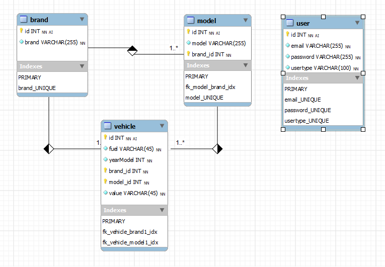

Banco utilizado: MySql
O mesmo pode ser trocado facilmente em virtude de ter sido utilizado KnexJS para tratar banco.

Não instalei o servidor do banco, utilizei UniServer Zero XIV para rodar versão portable do server mysql.
O mesmo pode ser encontrado em : [Universer Zero XIV](https://www.uniformserver.com/)

Banco criado usando MySQL Workbench.
Também não instalei o mesmo. Utilizei versão portable.
Pode ser encontrado em: [MySQL Workbench Portable](http://www.winpenpack.com/en/download.php?view.1229)

Criei o modelo. Salvei como modelo.mdb



Exportei o script gerador do banco para MySql.

Fiz isso tudo pra poder agilizar a geração do script sem erros.


No banco, após rodar o script logo abaixo, vai ter 2 usuários criados com respectivos tipos: admin e user.

As senhas foram salvas no banco usando bcrypt 10 passos.

Rotina de criação de usuários ainda não foi desenvolvida. Usuários foram criados no banco na mão.
Senhas foram criptografadas online usando o site: [Bcrypt Online](https://www.browserling.com/tools/bcrypt)
os usuários existentes são:
```
admin@email.com
password: 123

tiago@email.com
password: abc
```
Para testar, seguir os passos abaixo:

Clone o repositório do git para seu computador.

Deixe o servidor do banco rodando.

Entrar na pasta database e agora ou rodar script mydb_backup.sql que gera o banco mydb e as tabelas brand, model e vehicle e já insere os dados,

ou 

Rodar script database_script.sql para criar o banco mydb e as tabelas brand, model e vehicle.

Rodar script populate_script.sql para inserir tuplas nas tabelas.

Estou utilizando vscode como editor para o código.

O mesmo pode ser instalado a partir de : [VSCode](https://code.visualstudio.com/)

Instalar NodeJS. [NodeJS](https://nodejs.org/en/)

Plugins do vscode: REST Client. Desenvolvedor: Huachao Mao
Instalar esse plugin no vscode para poder testar a API de dentro do vscode super simples sem precisar de CURL ou POSTMAN, etc.
A API vai ser testada em 4 arquivos já gerados aqui:
```
test_user.http
test_brands.http
test_models.http
test_vehicles.http
```
Entrar no diretorio do projeto clonado. entrar pelo windows.

Rodar o comando: "code ." sem as aspas

O vscode vai abrir já dentro do projeto.

Apertar CTRL + " (isso vai abrir um terminal de comando dentro do vscode).

Os demais comando vou rodar nesse terminal.

No terminal do vscode rodar o comando: node -v 

Se instalou tudo certo vai ver a versão do node instalado. ele já instala o npm junto.

Esse programa é usado para gerenciar software necessário para rodar o projeto.

Basta agora executar na linha de comando: "npm install package.json" sem as aspas.

Ele vai instalar tudo que precisa para fazer rodar o projeto.

Ao terminar basta estando dentro da pasta do projeto rodar o comando: npm start

Agora o servidor vai estar online escutando na porta 3000.

Agora basta abrir os arquivos com extensão http para testar a API.

Exemplo: test_user.http

Ao abrir vc vai ver que aparece uma frase "Send Request" em cima de cada requisição. Basta clicar em cima e ver acontecer a chamada na respectiva rota e mostrar o resultado em janela lateral.

OBS: o primeiro a ser testado DEVE ser o test_user.http pois o mesmo vai retornar um token que vai ser usado em todas
 as demais consultas.

Quando obter o token, copiar e colar substituindo o mesmo nos demais arquivos http na frente da palavra token em todos.

Pode-se criar um token para usuario admin e outro token para usuario tiago para testar as funcionalidades usando
um usuario normal e um usuario admin para ver as difereças no resultado.

Ainda faltam várias melhorias como inserção de usuários, Falta fazer os testes, etc.

<tetigo@gmail.com>